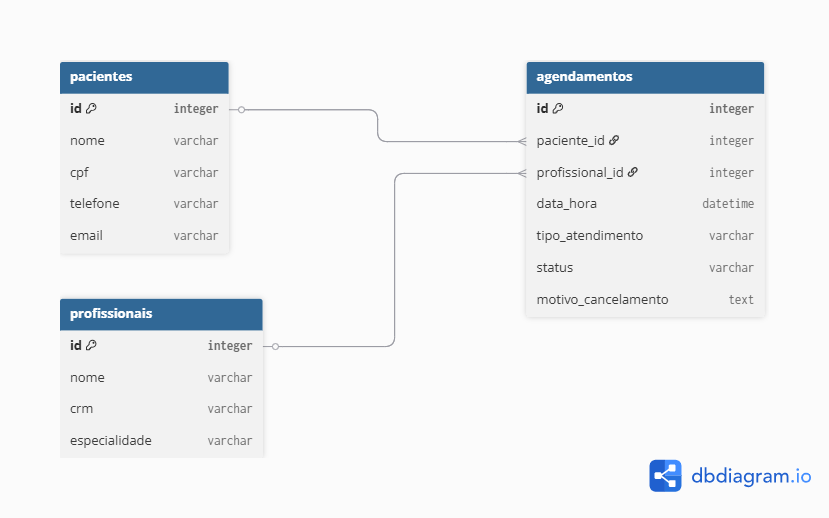

<div align="center">

# API de Agendamento Clínico
Sistema de Gerenciamento e Controle de agendamentos de consultas.

</div>

---

##  Sobre o Teste

Essa API foi desenvolvida com a finalidade de solucionar a necessidade de organização de uma clínica médica. 
Seu foco principal é garantir a integridade dos dados e o cumprimento das regras de negócio, como a disponibilidade dos profissionais e a organização das consultas.

A aplicação funciona como "o cérebro" de um sistema de gestão, permitindo que recepcionistas e administradores realizem operações de cadastro e agendamento de forma segura, evitando erros comuns de conflitos de horários ou datas passadas.

---

##  Funcionalidades Principais

- [x] Cadastro e Listagem de Pacientes.
- [x] Criação de Agendamentos com validação de disponibilidade do profissional.
- [x] Listagem de Agendamentos com filtros (Paciente, Profissional, Status).
- [x] Cancelamento de consultas com registro de motivo.

---

## Diferenciais
**Front End Integrado:** O projeto inclui uma interface web funcional para visualização
de agendamentos e cancelamentos em tempo real.

**Documentação Swagger:** Endpoints documentados e testáveis via interface Swagger.

**Regras de Negócio Blindadas:** Validações para impedir agendamentos no passado ou 
conflitos de horário para o mesmo profissional.

---

## Regras de Negócio Implementadas
**Validação de Data** Validação de Data: Não é permitido agendar consultas em datas ou horários que já passaram.

**Conflito de Horário:** Um profissional não pode ter dois agendamentos no mesmo horário.

**Status Automático:** Todo novo agendamento nasce com o status AGENDADO.

**Cancelamento com Motivo:** Ao cancelar, o status muda para CANCELADO e o motivo é registrado.

---

## Tecnologias e Ferramentas
- **Java 21** (Linguagem principal)
- **Spring Boot 3** (Framework para a API)
- **Spring Data JPA** (Persistência de dados)
- **H2 Database** (Banco de dados em memória)
- **Swagger/OpenAPI** (Documentação)
- **Maven** (Gerenciador de dependências)
- **HTML/JavaScript** (Front-end minimalista)

---
## Como Rodar?
### Pré-requisitos
- Java 21 ou superior instalado.

### Instalação
```bash
1. Clone o repositório
#git clone [https://github.com/barbpsouza/teste-tecnico-clinica-api.git]
2. Certifique-se de ter o Java 21 instalado.
3. Abra o projeto na sua IDE favorita (Recomendado: IntelliJ IDEA).
4. Execute a classe TesteApplication.
5. A API estará disponível em http://localhost:8080.

```

## Como TESTAR a API
Abaixo, exemplos de formatos de dados para testar via Insomnia ou Postman:

```bash

## 1. CRIAR PACIENTE
*POST http://localhost:8080/pacientes*
{
  "nome": "Babi Teste",
  "email": "babi@email.com",
  "telefone": "11988887777",
  "cpf": "12345678901"
}

## 2. CRIAR AGENDAMENTO
*POST http://localhost:8080/agendamentos*
{
  "paciente": { "id": 1 },
  "profissional": "Dra. Renata Silveira",
  "dataHora": "2026-11-20T14:30:00"
}

## 3. CANCELAR AGENDAMENTO
*PUT http://localhost:8080/agendamentos/{id}/cancelar*
{
  "motivo": "Paciente não poderá comparecer"
}
```

---

## Modelo de Dados
Abaixo, a estrutura do banco de dados relacional desenhada para este projeto:



---
Desenvolvido por **Bárbara Paranhos** - [Meu LinkedIn](https://www.linkedin.com/in/barbpsouza/)
# Thank U!
